# Procés complet de còpies de seguretat amb Linux i Duplicity

Al primer que farem serà veure el nom del disc, la mida, etc. Amb aquesta comanda:

lsblk -ol NAME,SIZE,TYPE,MOUNTPOINT  
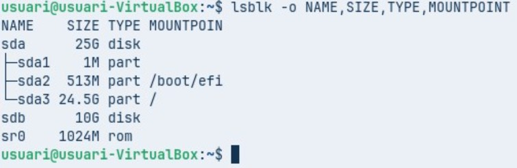

Ara el que farem serà muntar el disc (/dev/sda3) a /media/backup, comprovant que està muntat amb df -T, i instal·lant o verificant l’eina duplicity per fer les còpies de seguretat.  
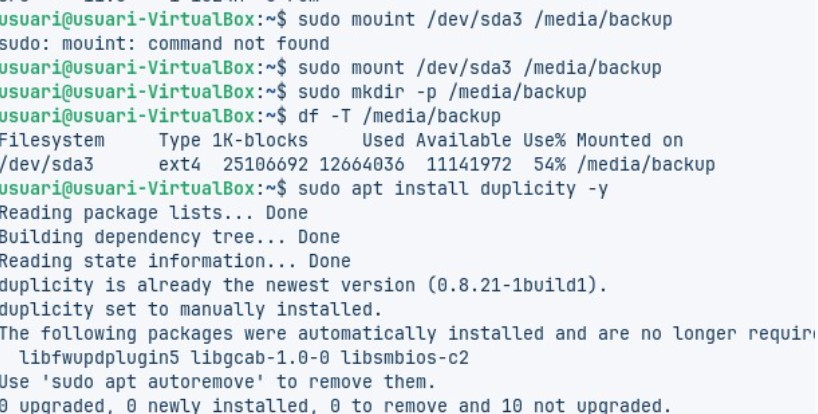

Ara el que farem serà afegir usuari2 amb la comanda:

sudo adduser usuari2  
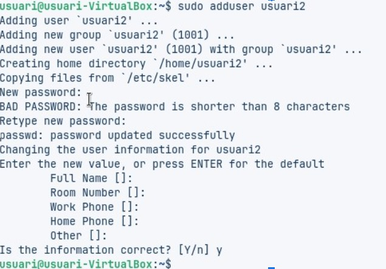

Entrarem com a root amb la comanda:

sudo su  
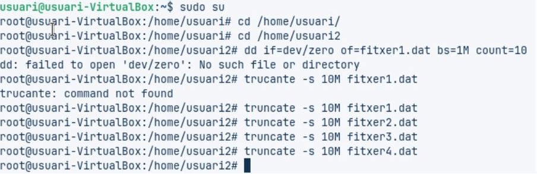

Ara entrarem dins de duplicity amb la comanda:

sudo duplicity \  
--full-if-older-than 1W \  
/home \  
file:///media/backup/home_repo/

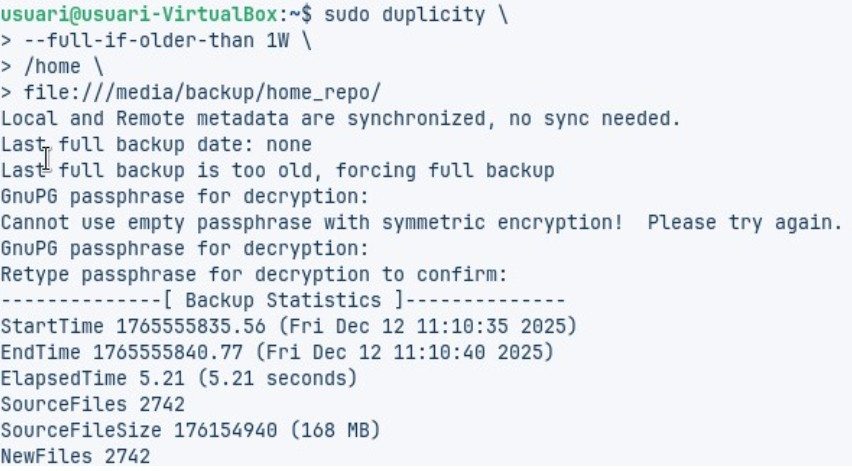

Ara estem esborrant tots els fitxers .dat que comencen per “fitxer” del directori /home/usuari2, com a root, amb la comanda:

rm fitxer*.dat  
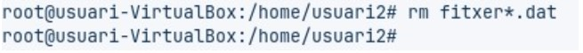

Estem creant una carpeta de restauració i restaurant una còpia de seguretat amb duplicity des de /media/backup/home_repo/ cap a /home/usuari/restore_test. Durant el procés es demana la contrasenya GPG per desxifrar. Les comandes són:

mkdir -p /home/usuari/restore_test  
sudo duplicity \  
file:///media/backup/home_repo/ \  
/home/usuari/restore_test/

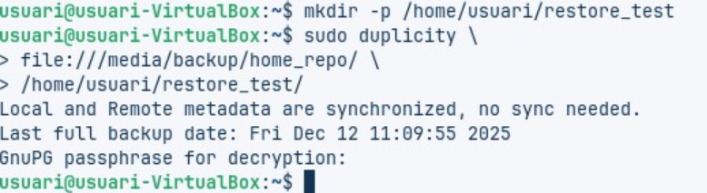

Aquí el que faig és desmuntar el dispositiu de backup amb la comanda:

sudo umount /media/backup  
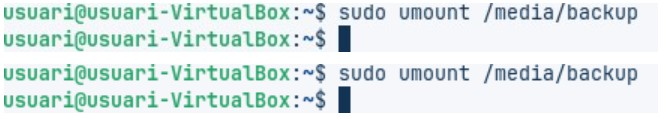

Entrem com a root per tenir permisos, anem al directori de l’usuari i redimensiono un fitxer a 4 MB amb truncate. Després faig una còpia de seguretat del directori /home a un disc extern amb Duplicity, introdueixo la contrasenya GPG i comprovo que el backup es fa correctament.  
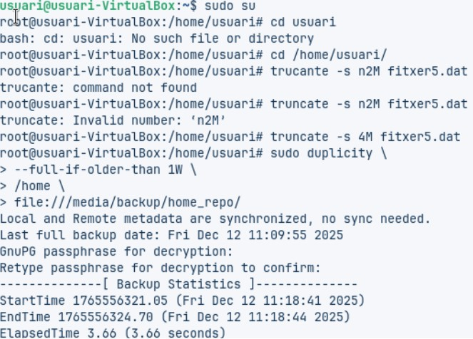

Ara editem un script Bash amb nano (fullbackup.sh) per automatitzar una còpia de seguretat.  
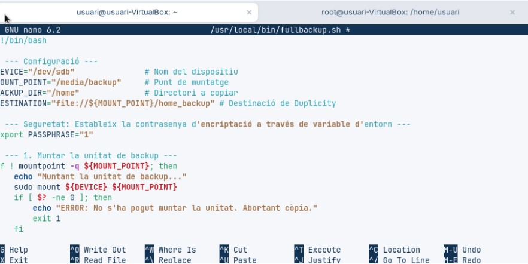

En la imatge següent podem veure que s’ha creat tot correctament.  

Ara, per programar la temporització, escriurem:

sudo crontab -e  
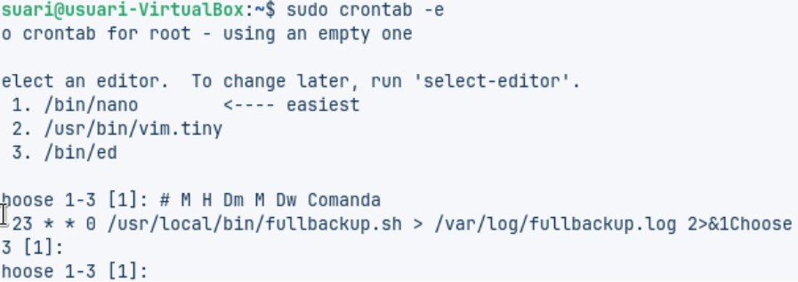  
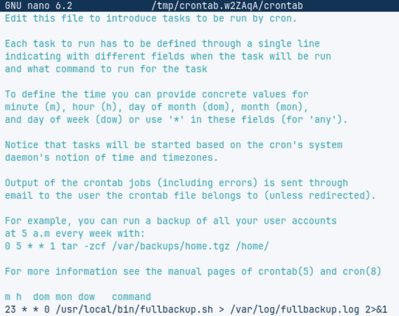
