# Part 1: Còpia de seguretat dels equips clients Windows

## Creació del disc de 10 GB
Crear una VM amb Windows 11 i dos discos (un per al sistema i un secundari de 10 GB).

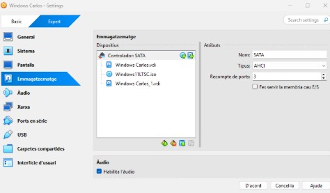

## Activar disc afegit
El primer que farem serà activar el disc que hem afegit.

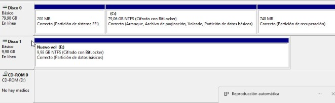

## Instal·lació de Duplicati
Hem de descarregar i instal·lar Duplicati:

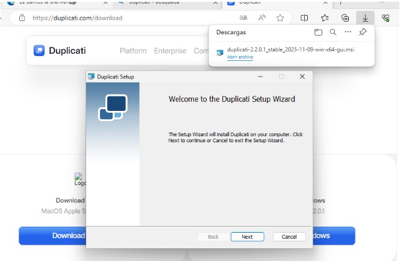

## Creació del Backup en el nostre disc
Primer de tot hem d'escollir el nom i la contrasenya d’encriptació, que això no té misteri.  
Després hem d'escollir la destinació del nostre backup:

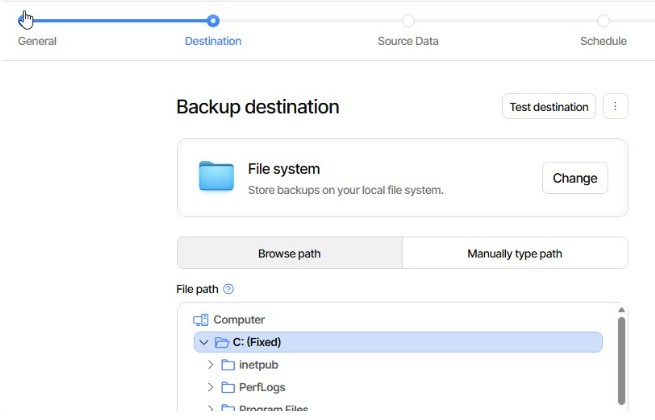

També haurem d'escollir les dades d’origen, com podeu veure en aquesta imatge:

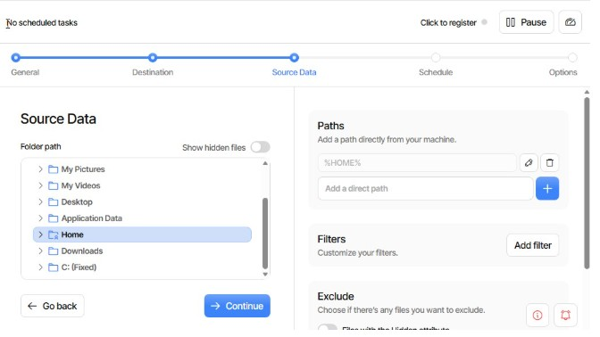

Podem programar les hores i els dies que volem que es facin els backups:

Ja tindríem el backup del nostre disc creat. Ara el que farem serà posar un document en el disc on hem escollit fer el backup.

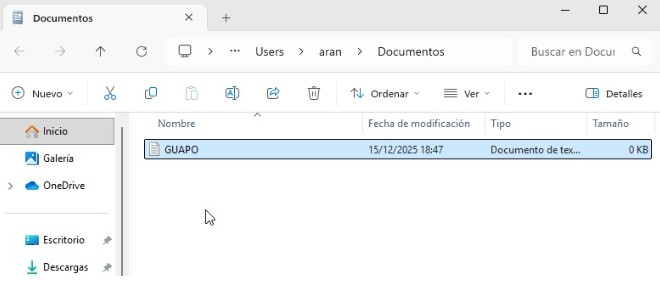

I ara activarem el backup tal com es veu a la imatge:

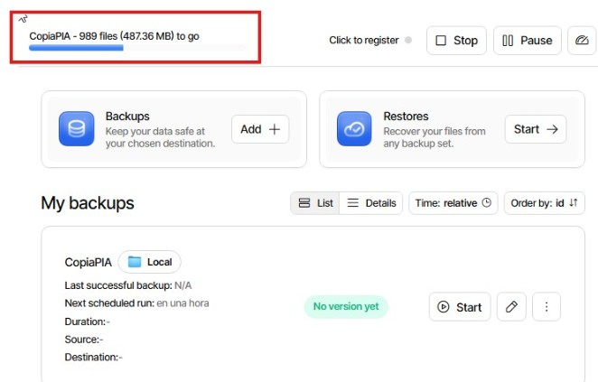

Aquí podem veure com ha guardat els arxius, perquè quan fem el restore tingui on trobar els arxius que hem de recuperar.

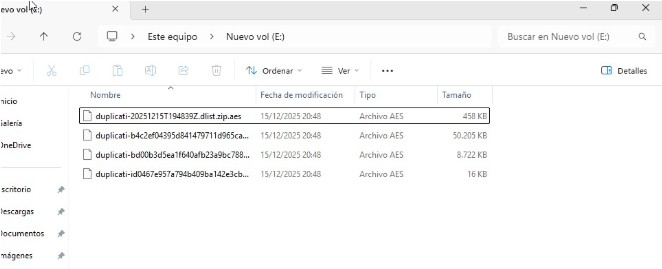

## Backup amb Google Drive
Ara farem el mateix però amb Drive.  
Primer de tot farem els mateixos passos que hem seguit per fer-ho en el disc local, però l’únic que canviarà serà la destinació, que ha de ser Drive:

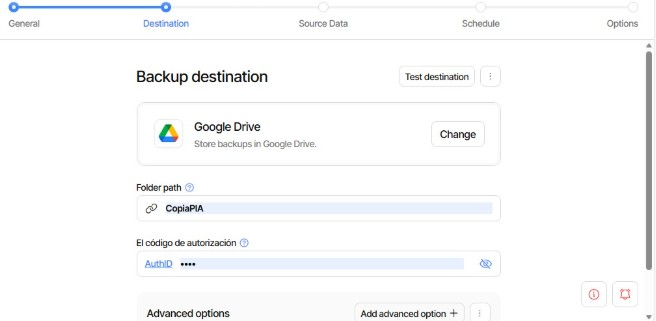

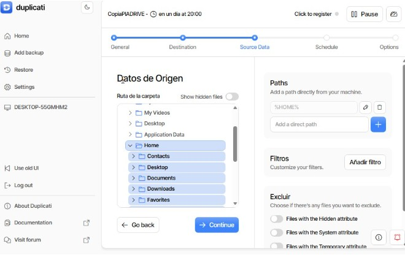

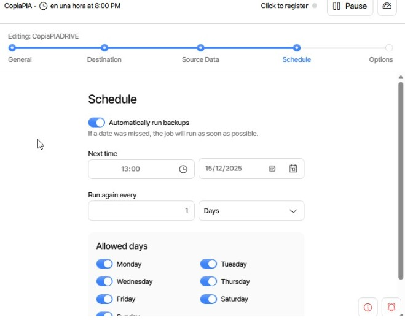

I ara, com podem veure, ja tenim els backups en marxa:

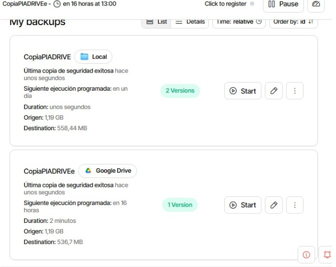

He posat en marxa el backup de Drive i, com podem observar, em surten els arxius.

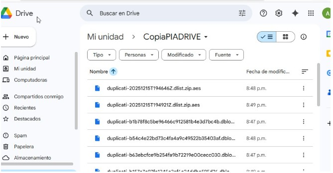

En el Drive podem veure que ha guardat les dades correctament.

## Validació
Ara farem un restore per recuperar les dades.

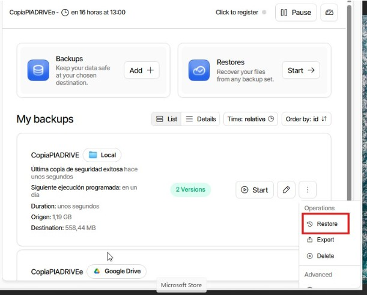

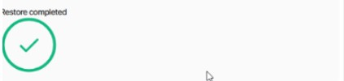

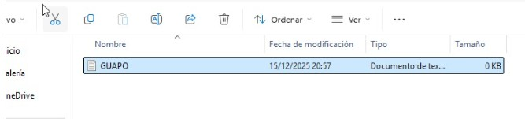

Un cop acabi de completar-se, veurem aquests arxius de Duplicati en la ubicació on hi havia l’arxiu que havíem creat.  
L’arxiu s’elimina, el que creem nosaltres, i d’aquesta manera el que fem és recuperar la informació.

