# Accés Remot. Connexió via SSH

Aran Pérez Rigau

Al primer que hem de fer es crear 2 màquines Virtuals, una ubuntu server i una Windows.

Haurem de cambiar la configuració de la xarxa NAT d'aquesta manera, i posar un  adaptador en amfitrió, que serà desde on ens connectarem per ssh.

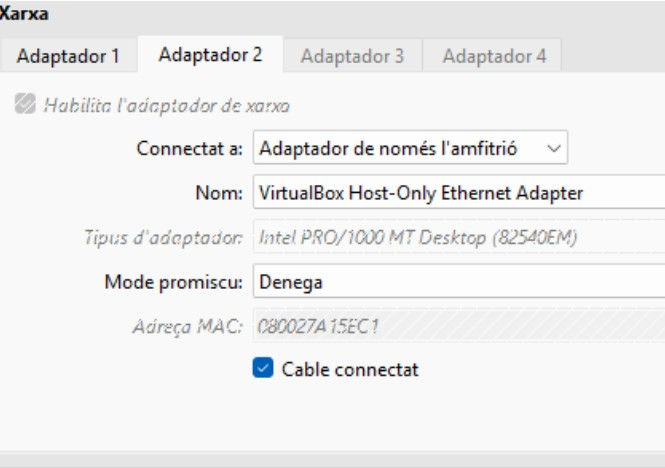 
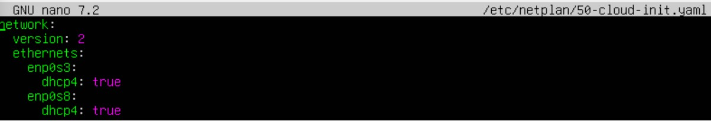 

Hem de instalar shh en la màquina de ubuntu amb un sudo apt install shh -y.
 

Un cop fet això farem un ip a, i ens connectarem desde la màquina windows a la del servidor, per comprovar que ho hem fet bé.
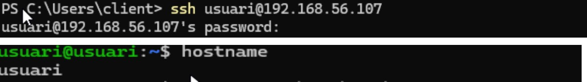 

## Configuració ssh:
AIXÒ HO FEM PER TENIR UNA LLISTA D'USUARIS AUTORITZATS I DESACTIVAR L'ACCÉS A ROOT  

Hem de entrar desde la màquina del servidor per configurar ssh, entrarem al seguent arxiu:  

`sudo nano /etc/ssh/sshd_config`  

I afegirem lo que posa a les captures:
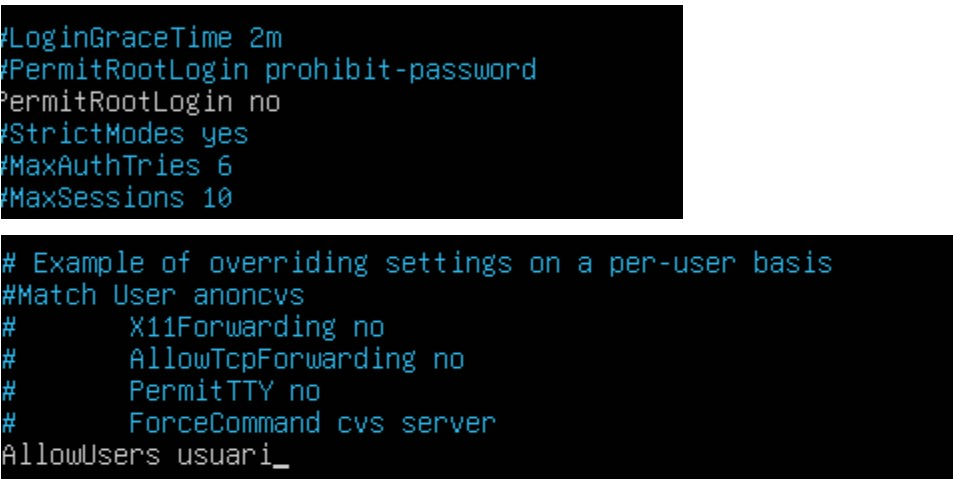 

Aquí estem dient que només pugui entrar usuari perquè crearem un 2n usuari i comprovarem que n pot entrar.
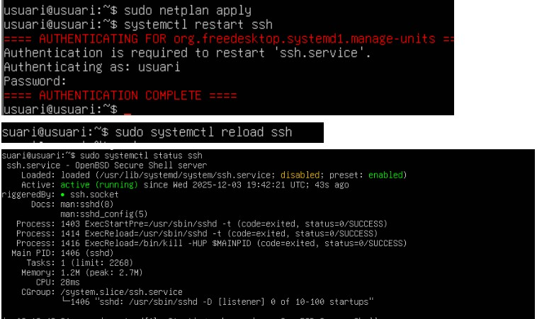 

Ara hem de crear un usuari que es digui usuari2  i configurar que no es pugui connectar per ssh aquest usuari2.
 

Com poder veure usuari2, no te permis:

 

## Part del túnel:

Ara ens connectarem des del nostre servidor, cap al client, amb un túnel SSH.
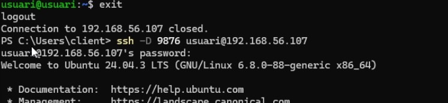 

Ara entrarem a les propiedades d'internet, i farem el següent:
 

## Wireshark:

Instal·larem al Wireshark, a la màquina del Windows, i d'aquesta manera podrem veure els paquets ssh.
 
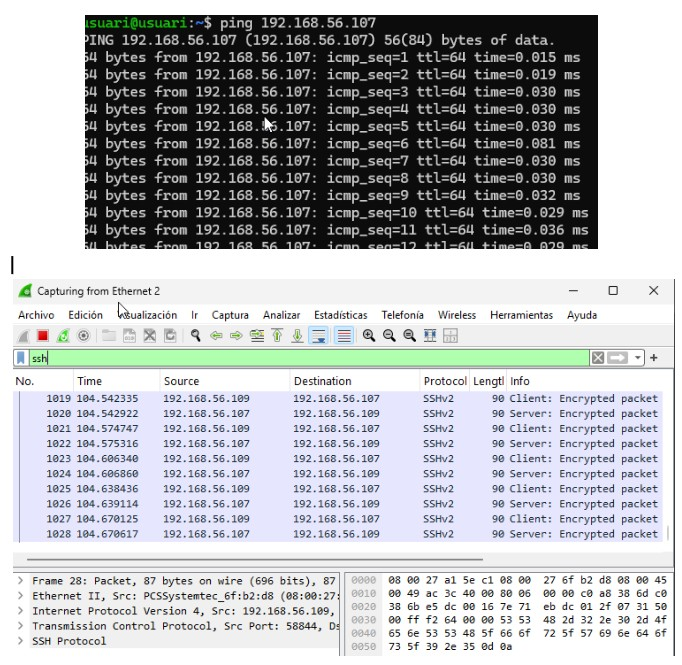 

## Iniciar sessió amb SSH Keys:
Al que farem serà posar una clau d'accés en al ssh, així de aquesta manera nosaltres no haurem de posar cap clau per entrar en remot, pero equips que no estiguin dins SI.

Ara escriurem totes aquestes comandes dins de la maquina del servidor.
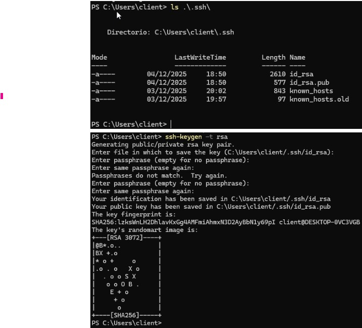 

Ara anirem a la maquina del servidor i escriurem aixo:
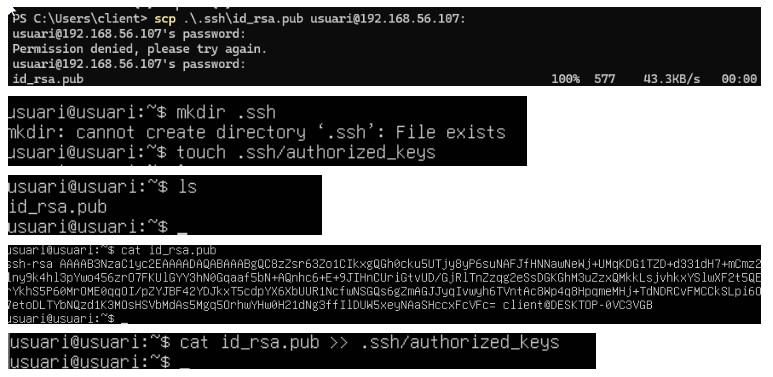 

I tornarem a la del client per comprovar:
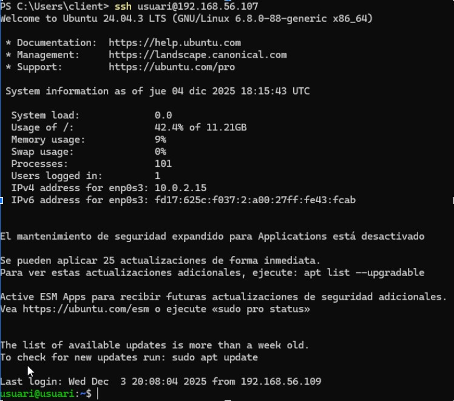 

## Iniciar sessió amb SSH Keys:

El primer pas es habilitar el servidor OpenSSH, que per defecte està activat.
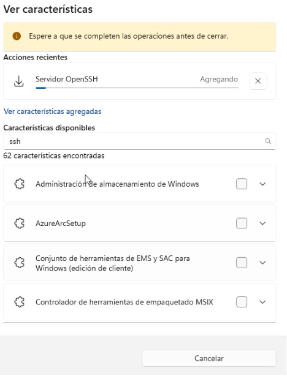 

Es necesari habilitar el servei per fer-ho, i indiquem que el servei s´engegui automàticament.
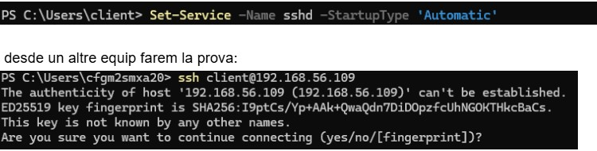 

I desde un altre equip farem la prova:
 

Aquesta comanda es per si dona error al fer la prova:
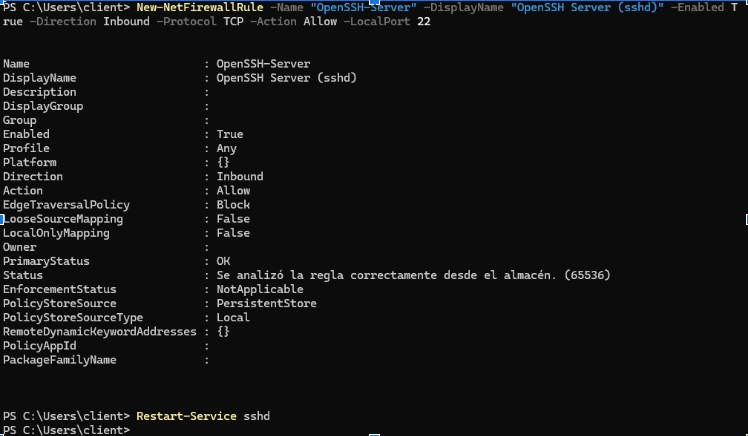 
