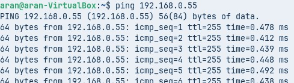
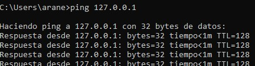
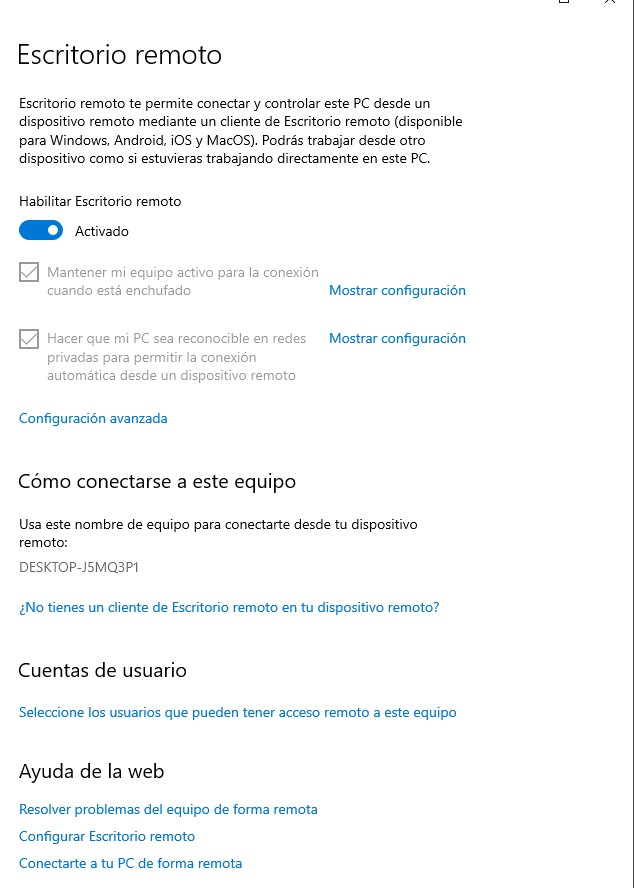
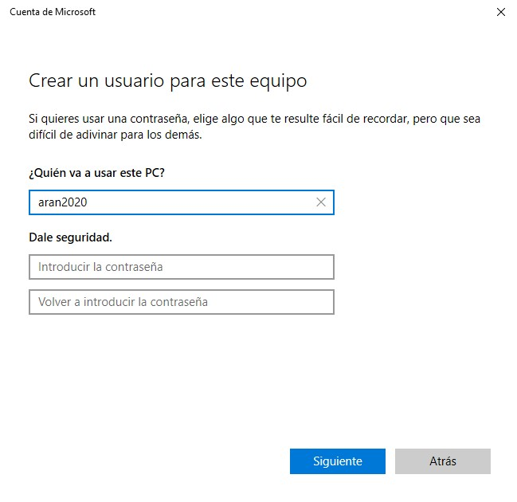
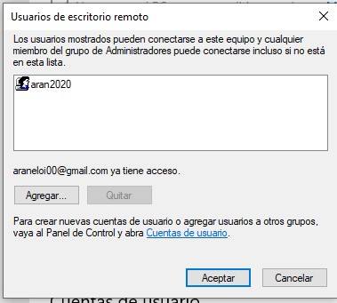
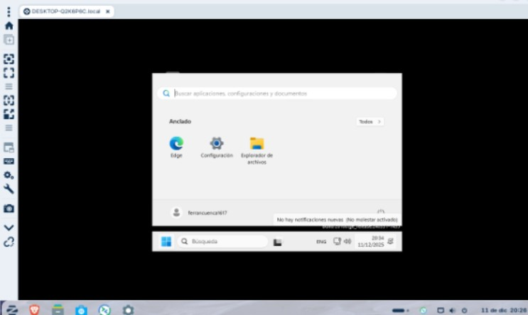
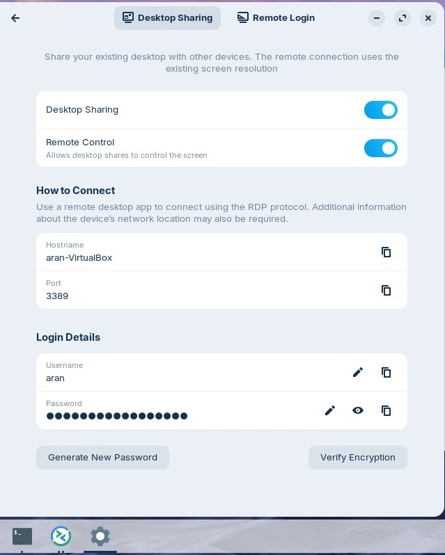
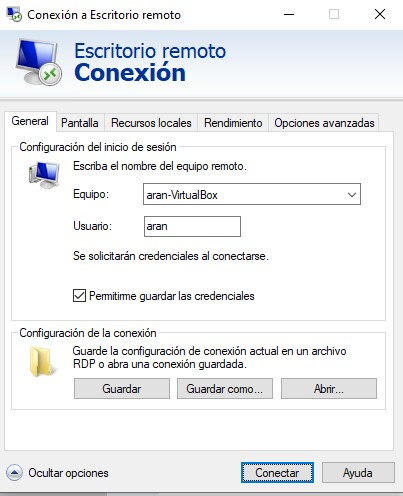

# Tasca 06

## Comprovació de connectivitat entre Windows i Zorin

Fem un ping de Windows a Zorin i de Zorin a Windows per comprovar que hi ha comunicació entre les dues màquines:

  

## Activació de l’escriptori remot a Windows

Ara entrarem a la màquina de Windows, anirem a la configuració del sistema i activarem l’opció d’**Escriptori remot**.

## Creació d’un usuari per a la connexió remota

Crearem un usuari nou per poder realitzar la connexió remota.

A continuació, anem a **Usuaris d’escriptori remot** i afegim el nom del compte creat. En el meu cas, el nom d’usuari és **aran2020**.

## Connexió des de Linux amb Remmina

Ara obrirem l’aplicació **Remmina**, que és l’equivalent a Escriptori remot però per a Linux.

Un cop introduïm les dades al nostre escriptori, acceptem la connexió i ja estarem dins de la màquina Windows.

  

## Connexió inversa: de Windows a Linux

Ara farem el mateix però a l’inrevés. Primer mirarem com es diu l’equip Linux i activarem l’accés remot.

Des de la connexió remota, introduïm el nom de l’equip Linux i el nostre nom d’usuari, i fem clic a connectar.

Finalment, com podem veure, ja estarem dins de la màquina Linux.
