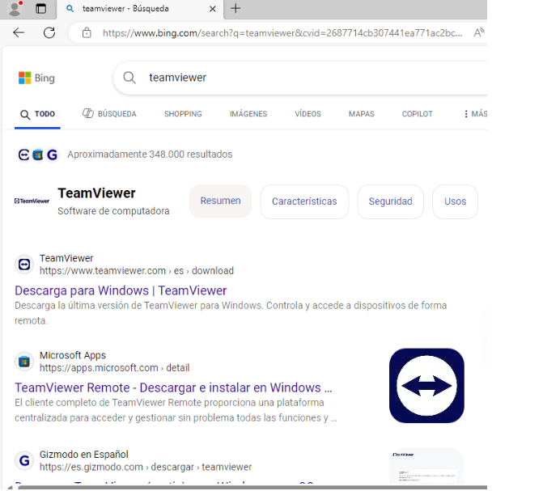
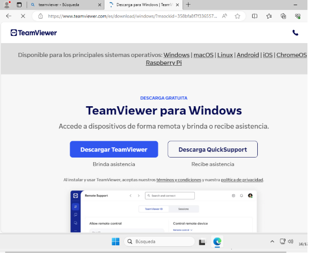
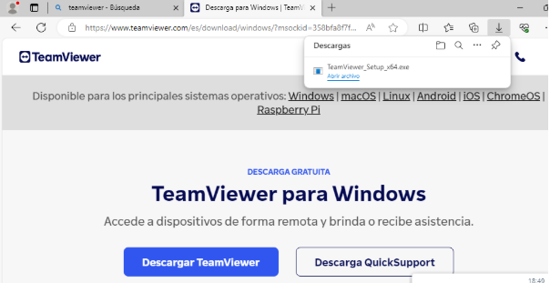
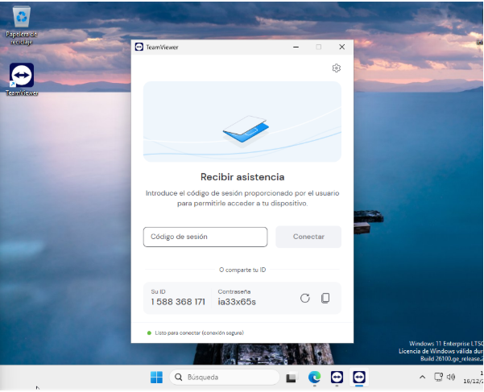
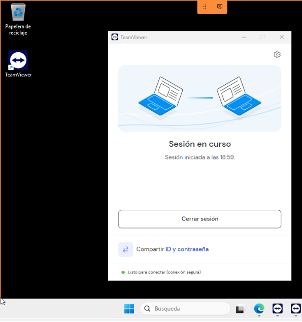

# T07 CLIENT

Primer buscarem  teamviewer en el buscador i el descarreguem. 

El descarreguem quicksupport. 

Aqui descarregarem el teamviewer quicksupport i l’executem.

Ara quan obrim hem de posar l’id en el meu cas 1 588 368 171 i una contrasenya en el meu cas ia33x65s que be predeterminat. 

Com podem veure ens hem pogut connectar desde la maquina principal al client amb l’id i la contrasenya que veiem anteriorment predeterminada. 

