# T07: Accés remot. Serveis d’assistència remota (tasca en parelles)

INSTAL·LACIÓ I CONFIGURACIÓ 

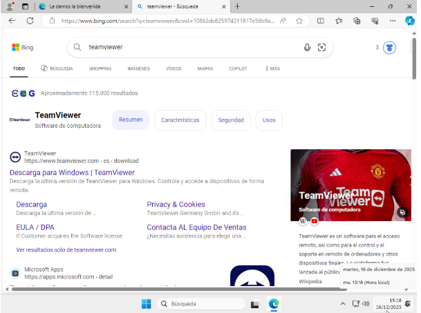

Primer de tot buscarem al navegador teamviewer i el descarregarem.

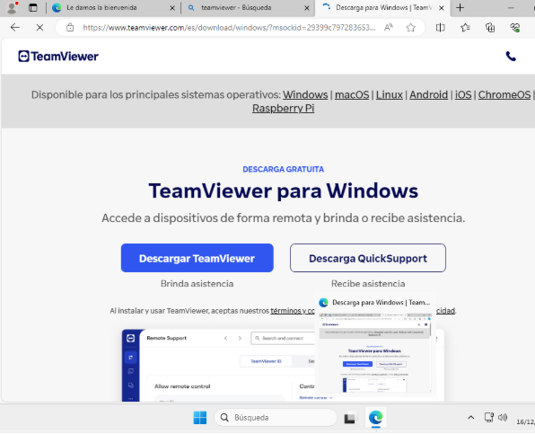

Al descarreguem per windows. 

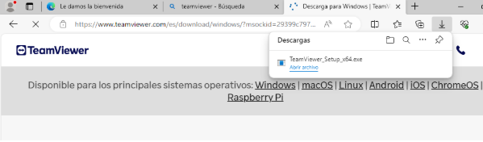

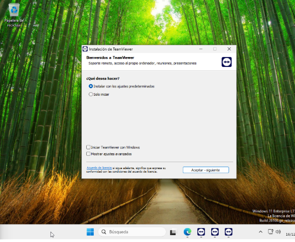

A la que executem el teamviewer ens deixa opcions de configuració hem de seleccionar la part de instalar con los ajustes predeterminador i li donem a acceptar es una actualització molt ràpida. 

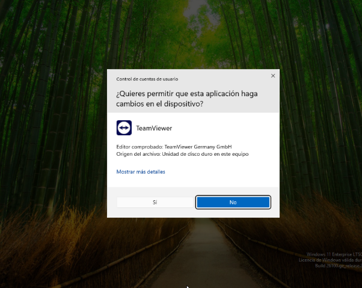

Un cop instalem ens demana permisos d'administració per poder continuar utilitzan l’aplicació cliquem si per continuar. 

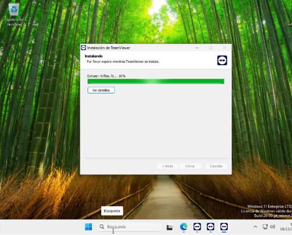

I podem veure com s’acaba de instal·lar correctament el teamviewer

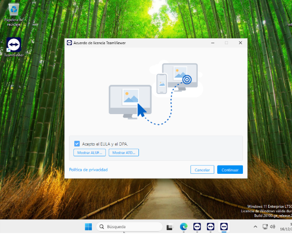

Marquem amb un tick la cassella de “ aceptar el EULA y el DPA que son els acords legals de aquesta aplicació. 

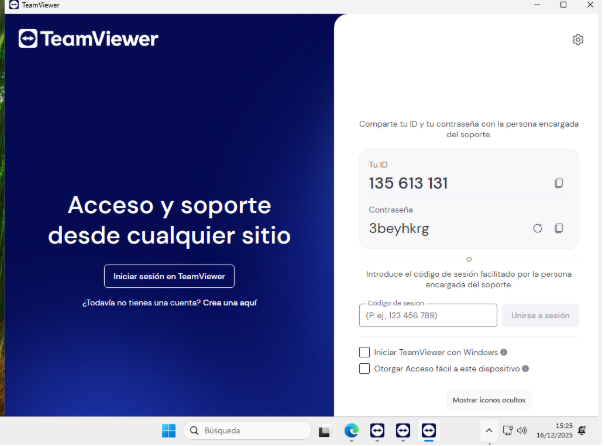

Una vegada instal·lat sobre l'aplicació amb un ID i una contrasenya predeterminada. 

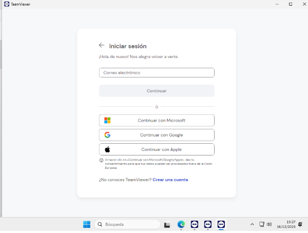

iniciem sessió en el meu cas google amb una conta personal i professional aunque es millor crearme una de nova especificament per això per ser més professional. 

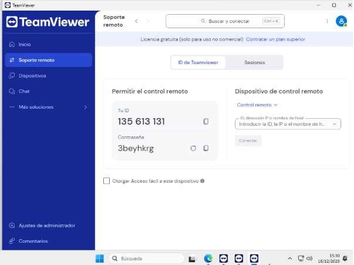

Un cop creem la conta i tot podem veure que s’ens obra l'aplicació i dins de l’aplicació podem veure al soporte remoto els dispositivos…

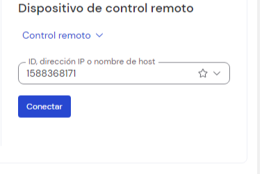

I ara posan al id de la maquina client ens conectarem. 

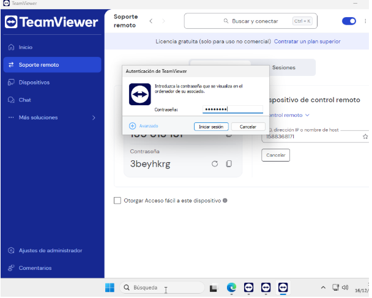

I posem la co0ntrasenya de la maquina client per acabar de verificar. 

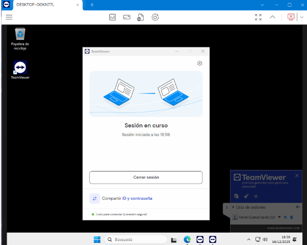

I com podem veure ara ja estem connectats a la maquina client desde la maquina principal. 
