## Tasca 09:

Al que hem fet en aquesta captura ha sigut crear els dos grups i que cada grup tingui una id asignada:

Manera de crear grup i forçar una id: sudo groupadd -g 2000 devs

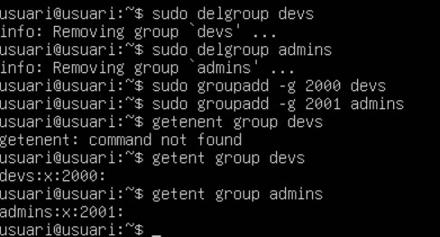 

Ara la que hem de fer es crear uns usuaris que es diguin dev01 i admin 01, i afegir-los a cada grup creat anteriorment:

Manera de crear usuari i afegir al grup amb la ID corresponen: sudo useradd -m -s /bin/bash -u 2000 -g devs dev01

Ara hem de afegir una contrasenya els dos usuari que acabem de crear dev01 i admin01:

Manera de afegir contrasenya: sudo passwd dev01

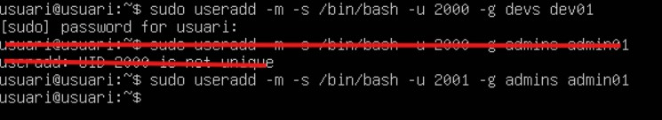 

Al que farem ara serà que els developers (grup dev) tinguin control total sobre els seus projecte i que l'usuari propietari sigui root:

Aixo es fa de la seguent manera:
sudo chown root:devs /srv/nfs/dev_projects
sudo chmod 2770 /srv/nfs/dev_projects

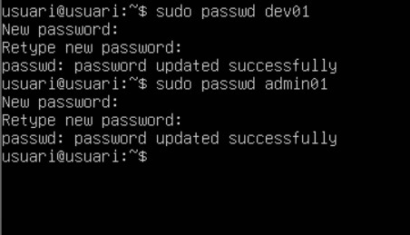 

Seguidament farem què els administradors (grup admin) tinguin control sobre les seves eines i que l'usuari propietari sigui root:

Això ho farem de la següent manera: 
sudo chown root:admins /srv/nfs/admin_tools
sudo chmod 2770 /srv/nfs/admin_tools

 

Verificació de tot al que hem fet: 
ls -ld /srv/nfs/dev_projects
ls -ld /srv/nfs/admin_tools

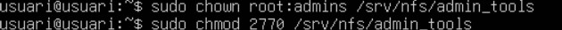 

Revisem que ho hem fet be:
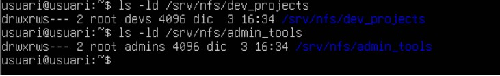 

Ara hem de fer la part final del servidor, que es exportar els directoris:

La farem de la següent manera: 

Primer farem un sudo apt update.
Seguidament farem un sudo apt install nfs-kernel-server nfs-common -y per instalar el servei que utilitzarem per fer l´exportació.

Ara haurem de configurar les exportacions NFS: 

Farem un sudo /etc/exports per poder editar el fitxer d´exportacions.

I posarem les dos coses que estan en blanc, per poder exportar els directoris, i farem un sudo systemctl restart nfs-kernel-server

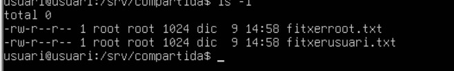 

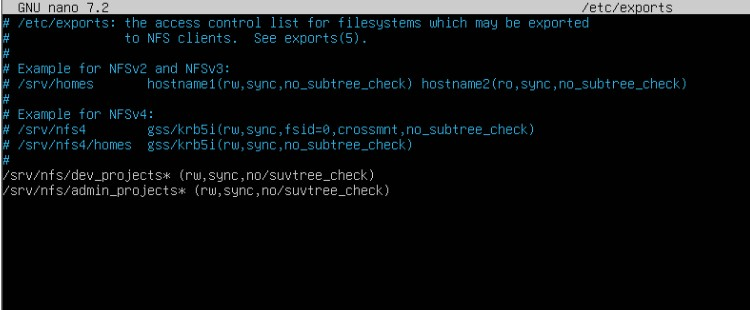 

 

Es tem miran al GID dels grups creats a la màquina linux
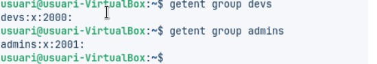 
Instalar NFS-common, que es al paquet que utilitzarem per al client.
Creem un arxiu dins de l´admin tools 
Mirem amb la comanda showmount la ip del servidor, perqeue ens dongui la resposta de les dos rutes creades al servidor, perque dongui resposta al client.
Creem la carpeta de dev_tools i posem un fitxer 

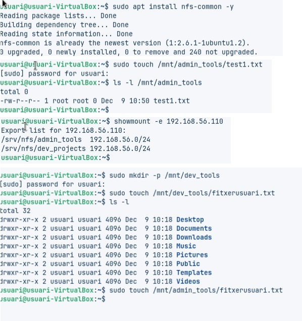 
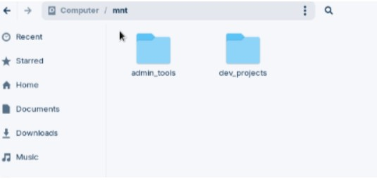 

Aquí estem posant que hi hagi més seguretat en els dos arxius.

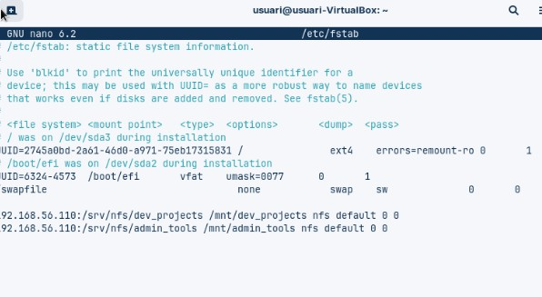 

Prova finaL:

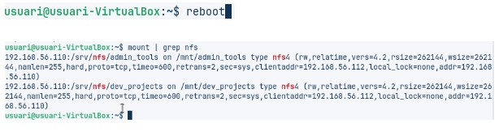 

